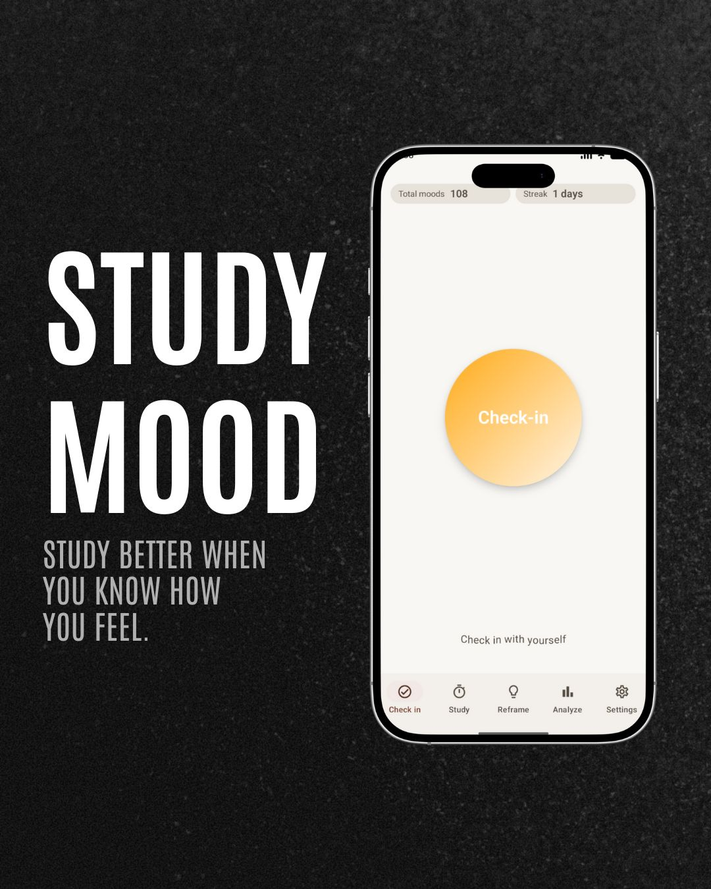
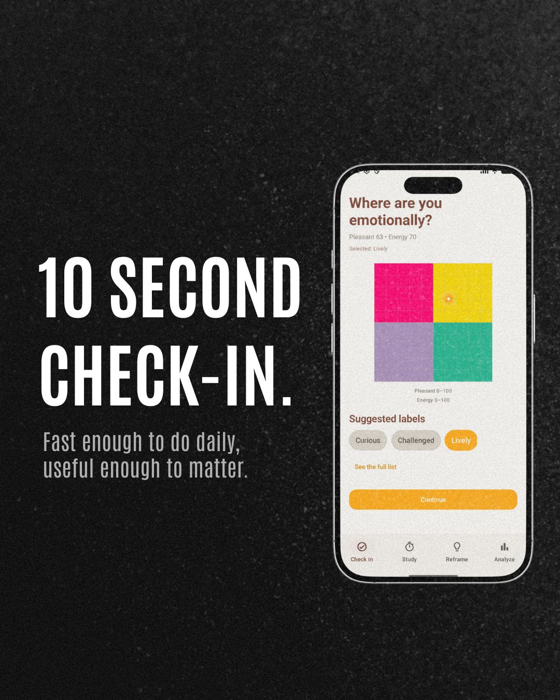
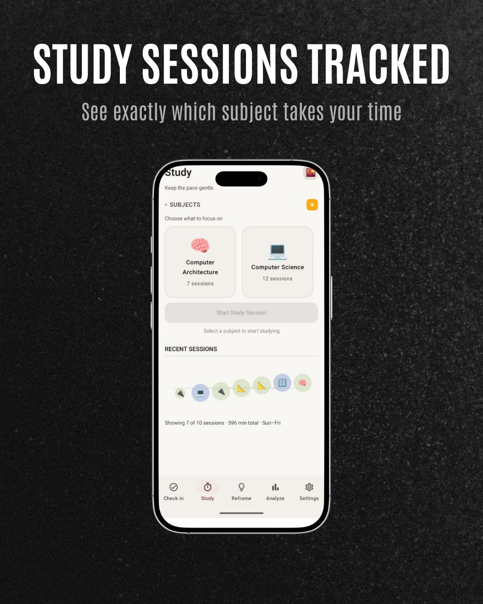
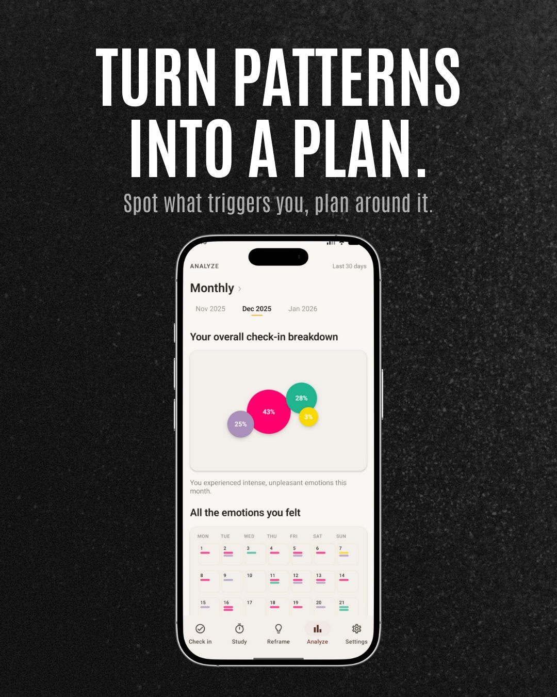
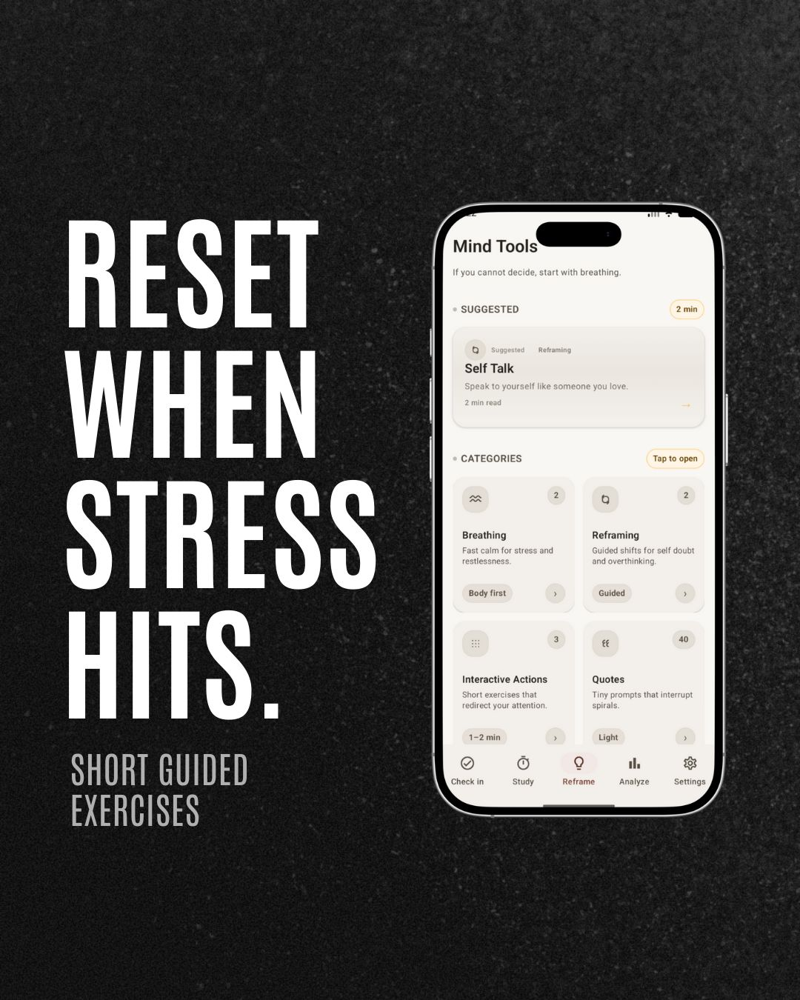
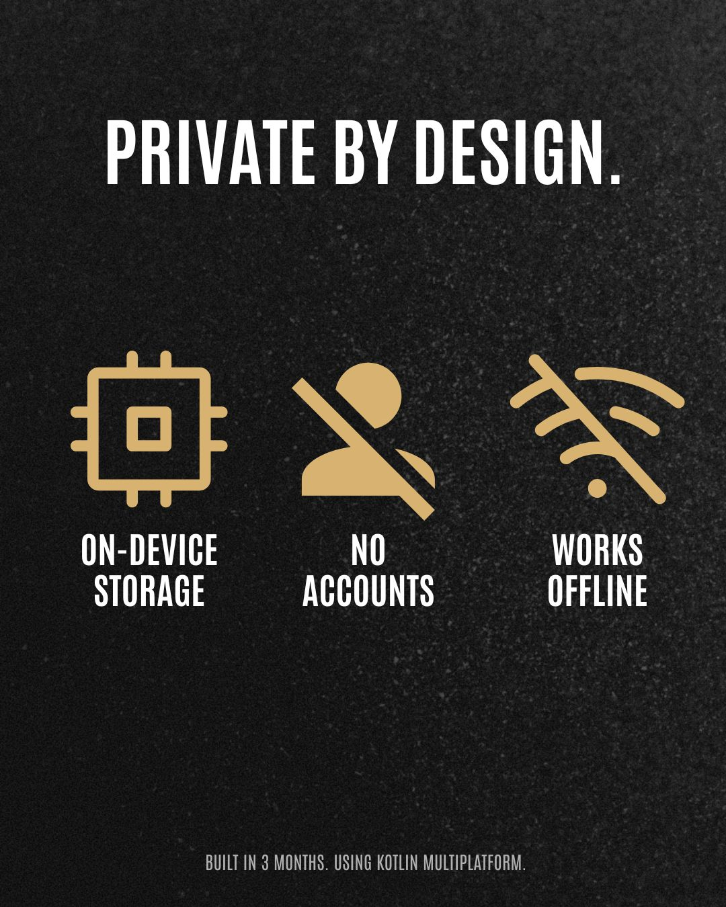

# Studymood

Studymood is a small app that supports day-to-day wellbeing and studying: quick mood check-ins, study sessions, and quick self-regulation tools (e.g. breathing, reframing).
The project is built with Kotlin Multiplatform (KMP) and Compose Multiplatform, so most UI and business logic is shared across IOS and Android.

## What you get

- Mood check-ins 
- Study mode 
- Mind tools (breathing, quotes, grounding-style exercises)
- Local persistence (SQLite via SQLDelight)

## Tech stack

- Kotlin Multiplatform
- Compose Multiplatform + Material 3
- SQLDelight (local storage)
- Koin (DI)

## Repository layout

- `composeApp/` - main KMP module (shared UI + logic)
- `composeApp/src/commonMain` - shared code (ui/domain/data)
- `composeApp/src/androidMain` - Android integration
- `composeApp/src/iosMain` - iOS integration
- `iosApp/` - Xcode project


Requirements:
- JDK 17
- Android Studio (Android) / Xcode (iOS)

Note (Windows + SQLDelight): the migration verification task possibly may fail due to file locking. If that happens:

```bash
gradlew.bat build -x verifyCommonMainStudyMoodDatabaseMigration
```


## App preview & Key Benefits

A quick visual look at the app and its key features.

| Study Mood | 10 Second Check-in |
|:---:|:---:|
|  |  |
| **Study Sessions Tracked** | **Turn Patterns Into a Plan** |
|  |  |
| **Reset When Stress Hits** | **Private By Design** |
|  |  |